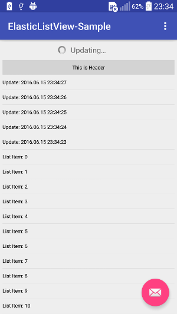
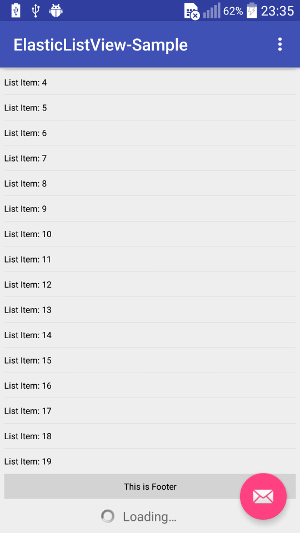

[](https://android-arsenal.com/details/1/4323)

# ElasticListView
ElasticListView extends android ListView and allows you pull down from the top of ListView to update data and pull up from the bottom of ListView to load data.

## Preview

        

## Installation

#### Gradle

Add it to your build.gradle with:
```gradle
allprojects {
    repositories {
        maven { url "https://jitpack.io" }
    }
}
```
and:

```gradle
dependencies {
    compile 'com.github.eschao:android-ElasticListView:v1.0'
}
```

## Usage

1. Use it in layout like android ListView. ElasticListView supports all attributes of android ListView

    #### Example:
    
    ```xml
            <com.eschao.android.widget.elasticlistview.ElasticListView
                android:layout_width="match_parent"
                android:layout_height="match_parent"
                android:paddingLeft="5dp"
                android:paddingRight="5dp"
                android:background="@null"
                android:cacheColorHint="#00000000"
                android:listSelector="#00000000"
                android:dividerHeight="1px"
                android:scrollbars="none"
                android:id="@+id/listview"
                android:overScrollMode="never"
                android:fadingEdge="none"
            >
    ```
2. Use it in java codes

    #### Example:
    
    ```java
            mListAdapter = new MyListAdapter(this);
            mListView = (ElasticListView)findViewById(R.id.listview);
            mListView.setHorizontalFadingEdgeEnabled(true);
            mListView.setAdapter(mListAdapter);
            mListView.enableLoadFooter(true)
                     .getLoadFooter().setLoadAction(LoadAction.RELEASE_TO_LOAD);
            mListView.setOnUpdateListener(this)
                     .setOnLoadListener(this);
            mListView.requestUpdate();
    ```
    
3. Your class should implement OnUpdateListener and OnLoadListener to complete update and load actions

    #### Example:
    
    ```java
        public class MainActivity extends AppCompatActivity
                              implements OnUpdateListener, OnLoadListener {
            
            @Override
            public void onUpdate() {
                // do update action
            }
            
            @Override
            public void onLoad() {
                // do load action
            }
    ```
    
4. Noramlly, update and load actions should be run in a separate thread, when these actions are done, you should call the below APIs to notify ElasticListView to change UI accordingly.

    #### Example:
    
    ```java
        // Notify update is done
        mListView.notifyUpdated();
        
        // Notify load is done
        mListView.notifyLoaded();
    ```
    
5. You can enable/disable update and load functions. By default, the update function is enabled and load function is disabled.

    #### Example:
    
    ```java
        // Enable/disable update function
        mListView.enableUpdateHeader(true); // or false to disable
        
        // Enable/disable load function
        mListView.enableLoadHeader(true); // or false to disable
    ```
    
6. If you added some header views in ElasticListview and now you want to enable update function again, you need to follow the below steps:

  * Remove all header views
  * Enable update function
  * Add all header views back
  
  The intention of these steps is to assure the update header is at the first position.

7. You can customize the update header view and load footer view

    #### Example:
    
    ```java
        // Set your own content view of update header and also need to
        // set your update state listener to change UI for different update state
        mListView.getUpdateHeader()
                 .setContentView(view, true)
                 .setOnUpdateStateListener(stateListener);
                
        // Set your own content view of load footer and also need to
        // set your load state listener to change UI for different load state
        mListView.getLoadFooter()
                 .setContentView(view, true)
                 .setOnLoadStateListener(stateListener);
    ```
    
8. There are three load action types, the default is AUTO_LOAD

  * AUTO_LOAD: when the load footer appears, the `onLoad()` will be called
  * RELEASE_TO_LOAD: when the load footer fully appears and touch is release, the `onLoad()` will be called
  * CLICK_TO_LOAD: when the load footer fully appears and user click it, the `onLoad()` will be called
  
    #### Example:

    ```java
        mListView.getLoadFooter()
                 .setLoadAction(LoadAction.CLICK_TO_LOAD);
    ```

## License
This project is licensed under the Apache License Version 2.0
